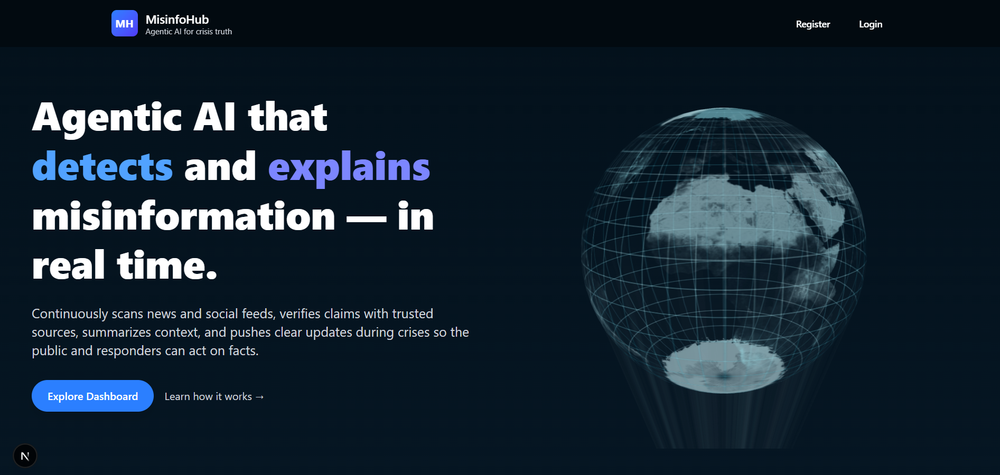
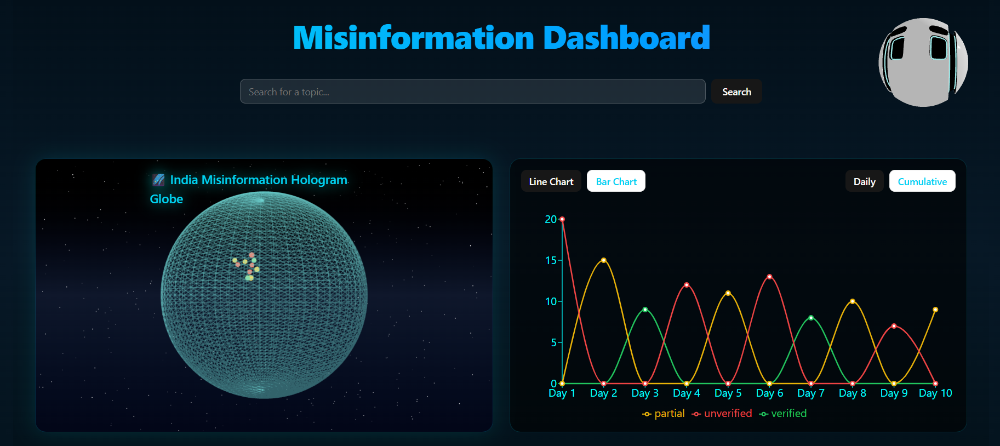
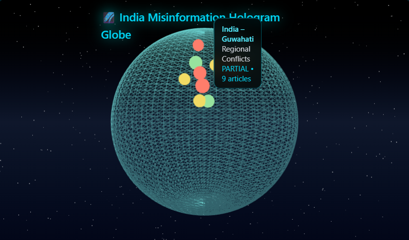
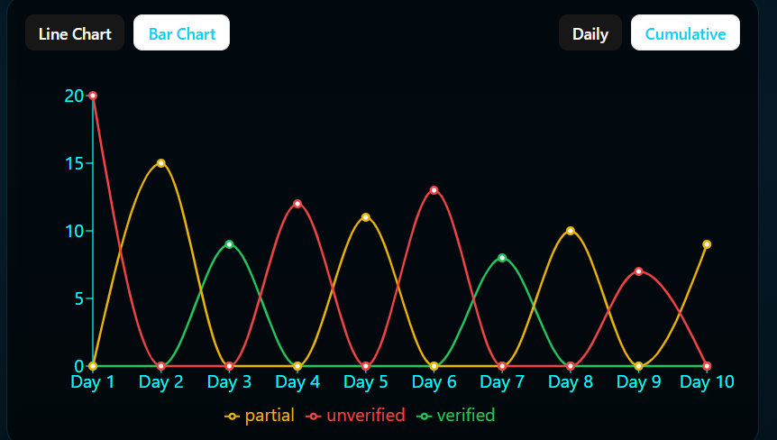
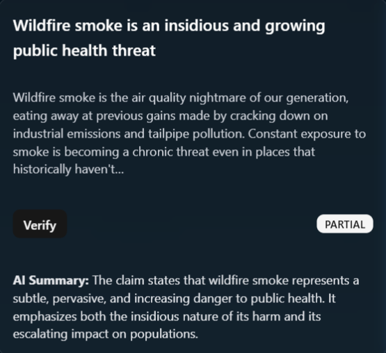

# 🧠 Misinfo Hub – AI-Powered Misinformation Detection Platform  

> **An interactive misinformation analysis platform** built with **Next.js**, **Three.js**, and **Gemini AI (gemini-1.5-flash-latest)**.  
> Visualize global misinformation trends, verify facts, and explore AI-powered summaries — all in one unified dashboard.

---

## 🚀 Features Overview

### 🏠 1. Homepage  
A clean landing section introducing Misinfo Hub with interactive visuals and a 3D AI avatar.  


---

### 📊 2. Dashboard  
A unified dashboard displaying user actions, recent verifications, and trusted news sources.  


---

### 🌍 3. Crisis Globe Visualization  
The **Crisis Dashboard** visualizes global misinformation spread on a **3D holographic globe** using `Three.js` and `@react-three/fiber`.  

Each hotspot glows based on credibility level:
- 🟢 **Verified**
- 🟡 **Partially Verified**
- 🔴 **Unverified**






---

### 📰 4. Article Search & Verification  
Fetch the latest articles through the integrated **Google Fact Check API**, then analyze them using **Gemini AI** for:  
- Claim verification  
- Bias detection  
- Sentiment & tone analysis  
- AI-generated summaries  




---

### 🤖 5. AI Integration (Gemini API)  
Misinfo Hub leverages **Gemini 1.5 Flash (latest)** for:  
- Context-aware fact verification  
- News summarization  
- Real-time misinformation categorization  

---

## 🧩 Tech Stack

| Layer | Technology |
|-------|-------------|
| **Frontend** | Next.js 14 (App Router) |
| **3D Visualization** | Three.js + @react-three/fiber |
| **UI Components** | ShadCN UI + TailwindCSS |
| **AI Engine** | Google Gemini (gemini-1.5-flash-latest) |
| **Database** | MongoDB (via Mongoose) |
| **API Routes** | Next.js Route Handlers |
| **Deployment** | Vercel |

---

## ⚙️ Getting Started

### 1️⃣ Clone the repository
```bash
git clone https://github.com/Prathamesh28jadhav/Mumbai-Hacks.git
cd Mumbai-Hacks

2️⃣ Install dependencies
npm install

3️⃣ Add environment variables

Create a .env.local file in the project root:

MONGODB_URI=your_mongodb_connection_string
GEMINI_API_KEY=your_gemini_api_key

4️⃣ Run the development server
npm run dev

🧭 Directory Overview
misinfo-hub/
├── .next/
├── node_modules/
├── public/
│   ├── logos/                # Brand & source logos
│   │   ├── file.svg
│   │   ├── globe.svg
│   │   ├── next.svg
│   │   ├── vercel.svg
│   │   └── window.svg
│   ├── models/               # 3D models
│   │   ├── misinformation_model.glb
│   │   └── agent-avatar.glb
│   └── screenshots/          # Images for README
│       ├── homepage.png
│       ├── dashboard.png
│       ├── globe.png
│       ├── article-search.png
│       └── verify.png
│
├── src/
│   ├── app/
│   │   ├── favicon.ico
│   │   ├── globals.css
│   │   ├── layout.tsx
│   │   └── page.tsx
│   │
│   ├── components/
│   │   ├── dashboard/
│   │   │   └── DashboardMain.tsx
│   │   ├── AgentAvatar.tsx
│   │   ├── FeaturesGrid.tsx
│   │   ├── Footer.tsx
│   │   ├── GlobeScene.tsx
│   │   ├── HeroSection.tsx
│   │   ├── Navbar.tsx
│   │   ├── Testimonials.tsx
│   │   ├── ThreeModel.tsx
│   │   ├── TrustedSources.tsx
│   │   └── CrisisDashboard.tsx
│   │
│   ├── ui/                   # ShadCN UI Components
│   │   ├── Card.tsx
│   │   ├── Button.tsx
│   │   ├── Badge.tsx
│   │   ├── Input.tsx
│   │   └── ...
│   │
│   └── lib/
│       ├── googleFactCheck.ts
│       ├── mongodb.ts
│       ├── openai.ts
│       ├── User.ts
│       └── utils.ts
│
├── .env.local
├── .gitignore
├── components.json
├── eslint.config.mjs
├── next-env.d.ts
├── next.config.ts
├── package-lock.json
├── package.json
├── postcss.config.mjs
└── README.md

💫 Visual Flow
User → Uploads or fetches article → Gemini AI → Verifies claim →
Updates Dashboard → Renders on 3D Globe → AI Summary displayed

🌐 Deployment

Easily deploy the app on Vercel with one click:

vercel deploy